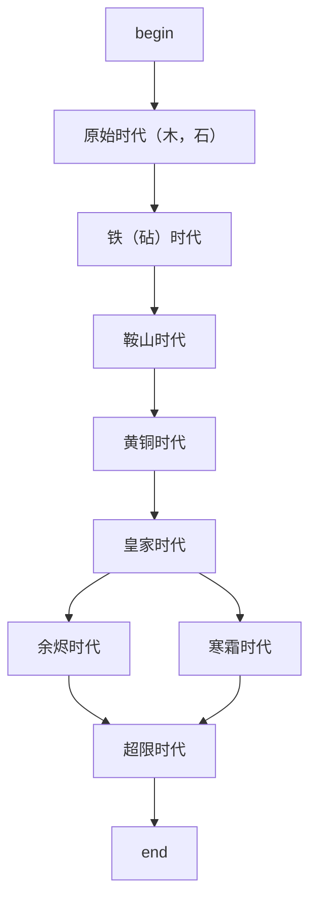

# 想法

```mermaid
graph TB
    A[begin] --> B[原始时代（木，石）]
    B --> C[铁（砧）时代]
    C --> D[鞍山时代]
    D --> E[黄铜时代]
    E --> F[皇家时代]
    F --> G[余烬时代]
    F --> H[寒霜时代]
    G --> I[超限时代]
    H --> I
    I --> J[end]
```

- 小型多方块空岛
- 有意思的开局
- 相对简单的资源获取
- 各不相同的矿物获取途径